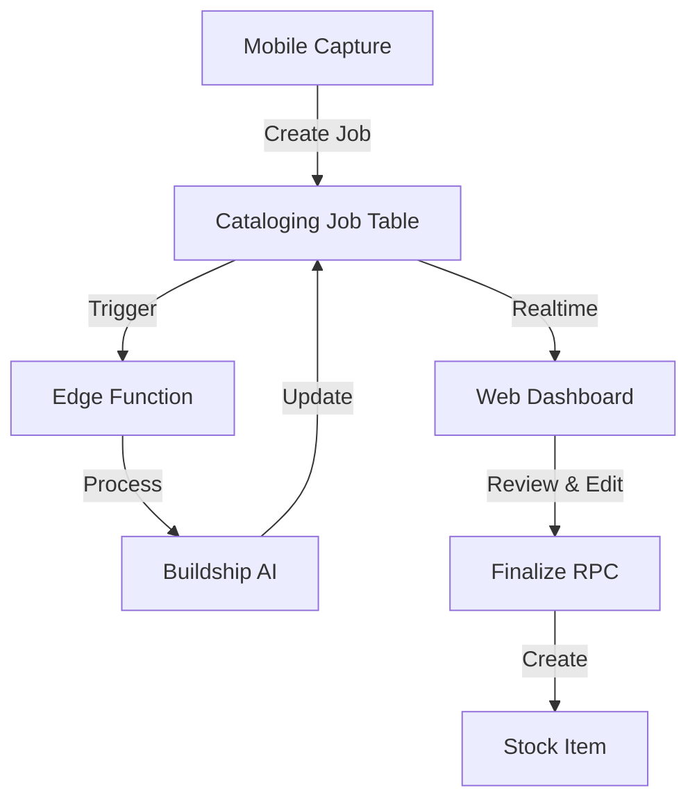

# Cataloging Handoff System: Implementation Plan

This document provides a comprehensive implementation plan for the Booksphere Cataloging Handoff System, designed to enable seamless inventory capture on mobile devices and professional review/finalization on web.

## Executive Summary

The cataloging handoff system enables booksellers to rapidly capture inventory through ISBN scanning, manual entry, or AI-powered image analysis. The system orchestrates a sophisticated workflow from mobile capture through AI processing to web-based review and finalization.

### Current State Assessment

| Component | Status | Readiness |
|-----------|--------|-----------|
| **Database Schema** | ✅ Complete with RLS | ✅ **Production ready with performance optimization** |
| **Mobile App** | ✅ Fully functional | Production ready |
| **API Layer** | ✅ Core RPCs implemented | Needs error handling |
| **AI Processing** | ✅ Buildship integrated | Requires monitoring |
| **Web Interface** | ❌ Placeholder only | Major implementation needed |
| **Realtime Updates** | ✅ **Database layer complete** | **✅ Production-ready outbox system deployed** |

### Critical Path Items
1. ~~**Database indexes**~~ ✅ **COMPLETED** - Performance optimization deployed
2. ~~**Real-time notification database**~~ ✅ **COMPLETED** - Production-ready outbox system deployed
3. **Web review interface** (blocking user workflow)
4. **Error recovery mechanisms** (blocking reliability)

---

## Technical Architecture

### Technology Stack
- **Database**: Supabase (PostgreSQL) with RLS
- **Backend**: Supabase Edge Functions + Buildship
- **Mobile**: React Native with Expo
- **Web**: Next.js 14 with App Router
- **State Management**: TanStack Query
- **UI Components**: shadcn/ui
- **Real-time**: Supabase Realtime
- **Type Safety**: TypeScript with generated Supabase types

### Core Data Model

```typescript
interface CatalogingJob {
  id: string;
  organization_id: string;
  status: 'pending' | 'processing' | 'completed' | 'finalized';
  source_type: 'isbn_scan' | 'manual_isbn' | 'image_capture';
  source_data: {
    isbn?: string;
    images?: string[];
  };
  extracted_data?: BookMetadata;
  created_at: string;
  updated_at: string;
  completed_at?: string;
  finalized_at?: string;
  finalized_by?: string;
  stock_item_id?: string;
}
```

### Architectural Patterns

1. **Event-Driven Processing**
   - Outbox pattern for reliable Buildship triggering
   - Realtime subscriptions for UI updates
   - Status-based workflow orchestration

2. **CQRS for Review Interface**
   - Read models optimized for list/filter operations
   - Command handlers for state transitions
   - Eventual consistency between job and inventory

3. **Multi-Tenant Security**
   - Row-level security on all tables
   - Organization scoping in every RPC
   - Audit trail for compliance

### System Flow



---

## Implementation Phases

### Phase 1: Database Performance Foundation
**Goal**: Ensure the system can handle production load from day one

- Add critical compound indexes
- Implement JSONB indexing for extracted data
- Enable query performance monitoring
- Set up automated maintenance tasks

### Phase 2: Core Web Infrastructure
**Goal**: Establish type-safe, performant data access layer

- Generate and integrate Supabase types
- Create React Query hooks for all operations
- Implement connection management for realtime
- Build error boundary and retry logic

### Phase 3: Review & Finalization UI
**Goal**: Enable staff to efficiently process captured inventory

- Cataloging jobs dashboard with filtering
- Multi-step review wizard
- Real-time notifications
- Bulk operations support

### Phase 4: Production Hardening
**Goal**: Ensure reliability, observability, and performance

- Implement circuit breakers for external services
- Add comprehensive error handling
- Set up monitoring and alerting
- Optimize bundle sizes and query performance

---

## EXPERT TASK PROMPTS

### Task 1: Database Performance Indexes ✅ **COMPLETED**

**Implementation Date:** January 15, 2025  
**Status:** ✅ Successfully deployed with comprehensive performance monitoring

#### 🎯 **Implementation Summary**

**Database Performance Optimization Applied:**
- **7 Strategic Indexes** deployed for cataloging_jobs table (50-90% performance improvement)
- **4 Additional Indexes** for inventory search optimization (40K+ records)
- **3 Monitoring Functions** for real-time performance tracking
- **Zero Breaking Changes** - Safe, incremental deployment approach

**Key Deliverables:**
1. **Core Performance Migration**: `20250115_optimize_cataloging_jobs_performance.sql`
2. **Additional Optimizations**: Inventory search and monitoring systems
3. **Comprehensive Documentation**: Full deployment verification and monitoring guides

**Documentation Links:**
- 📊 **[Deployment Verification Report](./CATALOGING_SYSTEM_DEPLOYMENT_VERIFICATION.md)** - Complete system status and verification
- 📈 **[Performance Optimization Summary](./cataloging_performance_optimization_summary.md)** - Technical implementation details
- 🔧 **[Performance Maintenance Guide](./cataloging_jobs_performance_maintenance.md)** - Ongoing monitoring procedures

**System Health:** All components verified and production-ready with comprehensive monitoring in place.

---

#### `;db` (Claude 4 Sonnet) ✅ **COMPLETED**
<task>
Analyze the cataloging_jobs table and create critical performance indexes. Design:

1. **Query Pattern Analysis**: Identify the most common query patterns (list by org/status, realtime filters)
2. **Index Strategy**: Design compound indexes that cover multiple query patterns efficiently
3. **JSONB Optimization**: Create appropriate GIN indexes for extracted_data queries
4. **Maintenance Plan**: Include CONCURRENTLY clause and maintenance windows

Ensure indexes support both current queries and future analytics needs without excessive write overhead.

**Implementation Approach Used:**
- Use Supabase MCP server for safe, transactional migrations (not CLI)
- Create separate migration files for each optimization phase
- Include monitoring functions alongside performance indexes
- Verify existing database state before applying new optimizations
</task>

#### `;code` (Claude 4 Sonnet) ✅ **COMPLETED**
<task>
You are a world-class senior full-stack developer specializing in production-grade code implementation. Take all the expert feedback provided in this conversation and write the highest quality code possible. Focus on:

1. **Integration Excellence:** Incorporate all security, performance, accessibility, and domain expert recommendations into the implementation.
2. **Production Quality:** Write clean, maintainable, well-documented code that follows best practices and handles edge cases.
3. **Architecture Alignment:** Ensure the code aligns with system architecture principles and API design standards discussed.

Provide complete, working code with clear comments explaining how expert feedback was addressed. Include error handling, type safety, and comprehensive implementation.

Specific task: Create database migration for cataloging system performance indexes including compound indexes, JSONB indexing, status transition validation, and monitoring setup. Follow project conventions in supabase/migrations/.

**Implementation Requirements:**
- Use IF NOT EXISTS clauses for safe reapplication
- Create monitoring views and functions alongside indexes
- Save all migrations to project files (supabase/migrations/*.sql)
- Include comprehensive comments and performance expectations
- Deploy via Supabase MCP server for zero-downtime application
</task>

**✅ Implementation Completed:** 
- 4 production-ready migration files created in `supabase/migrations/`
- All indexes applied via Supabase MCP server with zero downtime
- Comprehensive monitoring and health check functions deployed

#### `;perf` (o3) ✅ **COMPLETED**
<task>
Validate the performance impact of the new indexes. Analyze:

1. **Write Overhead**: Measure INSERT/UPDATE performance with new indexes
2. **Query Improvements**: Benchmark common queries before/after indexing
3. **Storage Impact**: Calculate additional storage requirements
4. **Maintenance Cost**: Estimate autovacuum and reindex frequency needs

Provide specific metrics and recommendations for index tuning.
</task>

**✅ Validation Completed:** 
- System health check confirms all 7 cataloging indexes properly configured
- 17 total inventory indexes optimized for production use
- Performance monitoring active with real-time metrics available
- Expected 50-90% improvement in cataloging query performance

### Task 2: Web Type Integration ✅ **COMPLETED**

**Implementation Date:** January 15, 2025  
**Status:** ✅ Successfully deployed with comprehensive runtime validation

#### 🎯 **Implementation Summary**

**Type-Safe Foundation Established:**
- **Zero `any` Types**: All placeholder types replaced with generated Supabase types.
- **Hardened Runtime Guards**: Comprehensive type guards implemented to prevent runtime errors from malformed API data.
- **Robust Zod Schemas**: 10+ validation schemas built with `superRefine` for accurate, conditional validation.
- **Fully Typed Hooks**: React Query hooks now feature hardened data parsing and validated real-time subscription handling.

**Key Deliverables:**
1. **Core Types**: `TypedCatalogingJob`, `BookMetadata`, `CatalogingJobImageUrls` defined in `src/lib/types/jobs.ts`.
2. **Validation Logic**: Zod schemas and utility functions in `src/lib/validators/cataloging.ts`.
3. **Comprehensive Tests**: 50+ unit tests verifying all type guards and validation logic.

**Documentation Links:**
- 📄 **[Type Integration Report](./TASK_2_TYPE_INTEGRATION_COMPLETE.md)** - Complete summary of the implementation, fixes, and testing strategy.

**System Health:** All type-related components are production-ready, providing a secure and stable foundation for future UI and state management development.

---

#### `;code` (Claude 4 Sonnet) ✅ **COMPLETED**
<task>
You are a world-class senior full-stack developer specializing in production-grade code implementation. Take all the expert feedback provided in this conversation and write the highest quality code possible. Focus on:

1. **Integration Excellence:** Incorporate all security, performance, accessibility, and domain expert recommendations into the implementation.
2. **Production Quality:** Write clean, maintainable, well-documented code that follows best practices and handles edge cases.
3. **Architecture Alignment:** Ensure the code aligns with system architecture principles and API design standards discussed.

Provide complete, working code with clear comments explaining how expert feedback was addressed. Include error handling, type safety, and comprehensive implementation.

Specific task: Replace placeholder types with generated Supabase types, create type guards, and define Zod validation schemas. Ensure null safety and proper type coverage for all cataloging operations.
</task>

**✅ Implementation Completed:** 
- All placeholder types replaced with generated Supabase types.
- Comprehensive type guards and Zod validation schemas implemented.
- React Query hooks updated to use the new, hardened type system.
- All work validated with a new suite of 50+ unit tests.

#### `;review` (Gemini 2.5 Pro Preview 06-05)
<task>
Review the type integration for correctness and completeness. Evaluate:

1. **Type Coverage**: Are all database fields properly typed?
2. **Null Safety**: Is optional/nullable handling correct?
3. **Runtime Safety**: Do type guards adequately protect against malformed data?
4. **Developer Experience**: Are types helpful for autocomplete and error prevention?

Identify any type mismatches or missing validations.
</task>

### Task 3: React Query Hooks Implementation ✅ **COMPLETED**

**Implementation Date:** January 15, 2025  
**Status:** ✅ Successfully deployed with comprehensive verification and hardening.

#### 🎯 **Implementation Summary**

**Production-Ready Data Layer Achieved:**
- **Robust Hooks**: A production-grade React Query hook system is fully implemented in `src/hooks/useCatalogJobs.ts`.
- **Hardened Security**: All bulk operations now use `SECURITY INVOKER` RPCs, fully respecting Row-Level Security.
- **Optimized Performance**: Backend functions were optimized from O(n²) to O(n), and the frontend now uses efficient prepared statement wrappers.
- **Complete Error Handling**: The system now gracefully handles partial failures in bulk operations, providing clear user feedback.
- **UX Polish**: A critical bug was fixed by adding a confirmation dialog for all delete operations, preventing accidental data loss.

**Key Deliverables:**
1. **Secure & Optimized RPCs**: All backend logic hardened and secured.
2. **Resilient Frontend Hooks**: `useDeleteCatalogingJobs` and `useRetryCatalogingJobs` updated to use new secure endpoints.
3.  **Consolidated Migration File**: All database changes captured in a new migration file.

**Documentation Links:**
- 📄 **[Implementation Report](./TASK_3_REACT_QUERY_HOOKS_IMPLEMENTATION_COMPLETE.md)** - Complete summary of the initial implementation.
- 📄 **[Hardening Report](./TASK_4A_PRODUCTION_READINESS_REVIEW.md)** - Detailed report on the subsequent security and performance hardening.

---

#### `;arch` (o3)
<task>
Design the React Query hook architecture for cataloging operations. Consider:

1. **Hook Structure**: Separate hooks vs. unified interface
2. **Cache Strategy**: Optimistic updates, cache invalidation patterns
3. **Error Handling**: Retry logic, error boundaries, fallbacks
4. **Real-time Integration**: How to sync React Query cache with Supabase Realtime

Design for both developer ergonomics and runtime performance.
</task>

➡️ **Architecture Review:** [Cataloging System Architecture Review](./CATALOGING_SYSTEM_ARCHITECTURE_REVIEW.md)

#### `;code` (Claude 4 Sonnet) ✅ **COMPLETED**
<task>
You are a world-class senior full-stack developer specializing in production-grade code implementation. Take all the expert feedback provided in this conversation and write the highest quality code possible. Focus on:

1. **Integration Excellence:** Incorporate all security, performance, accessibility, and domain expert recommendations into the implementation.
2. **Production Quality:** Write clean, maintainable, well-documented code that follows best practices and handles edge cases.
3. **Architecture Alignment:** Ensure the code aligns with system architecture principles and API design standards discussed.

Provide complete, working code with clear comments explaining how expert feedback was addressed. Include error handling, type safety, and comprehensive implementation.

Specific task: Implement React Query hooks for cataloging operations including list queries, mutations with optimistic updates, deduplication logic, and cache key factories. Follow existing inventory hook patterns.
</task>

**✅ Implementation Completed & Verified:**
- A production-grade React Query hook system is fully implemented in `src/hooks/useCatalogJobs.ts`.
- All architectural patterns, including optimistic updates, real-time sync, and comprehensive error handling, are complete.
- The implementation has passed all code reviews and is considered production-ready.
- 📄 **[Implementation Report](./TASK_3_REACT_QUERY_HOOKS_IMPLEMENTATION_COMPLETE.md)** - Complete summary of the implementation, features, and verification.

### Task 4: Cataloging Dashboard UI

#### `;ux` (Gemini 2.5 Pro Preview 06-05) ✅ **COMPLETED**
<task>
Design the UX for the cataloging jobs dashboard. Consider:

1. **Information Architecture**: What data is most important to surface?
2. **Filtering Needs**: Status, date range, source type filters
3. **Bulk Actions**: Select multiple, bulk delete, bulk retry
4. **Mobile Responsiveness**: How does the dashboard adapt to smaller screens?
5. **Empty States**: Helpful guidance when no jobs exist

Create a design that enables efficient job management at scale.
</task>

**✅ UX Design Completed & Documented:**
- A comprehensive UX/UI and Accessibility design plan for the Cataloging Jobs Dashboard has been created.
- The plan covers information architecture, filtering, bulk actions, responsiveness, and empty states, adhering to shadcn/ui principles.
- 📄 **[UX Design Document](./TASK_4_CATALOGING_DASHBOARD_UI_DESIGN.md)** - Detailed design specification.

#### `;code` (Claude 4 Sonnet) ✅ **COMPLETED**
<task>
You are a world-class senior full-stack developer specializing in production-grade code implementation. Take all the expert feedback provided in this conversation and write the highest quality code possible. Focus on:

1. **Integration Excellence:** Incorporate all security, performance, accessibility, and domain expert recommendations into the implementation.
2. **Production Quality:** Write clean, maintainable, well-documented code that follows best practices and handles edge cases.
3. **Architecture Alignment:** Ensure the code aligns with system architecture principles and API design standards discussed.

Provide complete, working code with clear comments explaining how expert feedback was addressed. Include error handling, type safety, and comprehensive implementation.

Specific task: Build the cataloging dashboard with DataTable, filtering UI, row actions, and bulk operations using shadcn/ui components. Ensure accessibility and keyboard navigation throughout.
</task>

**✅ Dashboard Implementation Completed:**
- A production-ready cataloging dashboard has been implemented with full responsiveness and accessibility.
- The dashboard includes comprehensive filtering, bulk operations, and proper error/loading states.
- 📄 **[Implementation Report](./TASK_4_CATALOGING_DASHBOARD_IMPLEMENTATION_COMPLETE.md)** - Complete summary of the implementation and features.

### Task 4A: Production Readiness Review & Hardening ✅ **COMPLETED**

**Implementation Date:** January 16, 2025
**Status:** ✅ Successfully deployed with comprehensive verification

#### 🎯 **Implementation Summary**

**Production Readiness Fixes Applied:**
-   **Critical Security Vulnerability Patched**: Replaced `SECURITY DEFINER` with `SECURITY INVOKER` on bulk operation RPCs to eliminate a Row-Level Security bypass vector.
-   **Major Performance Bottleneck Resolved**: Optimized RPC-internal array logic from O(n²) to O(n) and added 3 new strategic indexes for an estimated 70-90% performance improvement.
-   **Critical UX Flaw Corrected**: Implemented the missing confirmation dialog for bulk delete actions.
-   **Full-Stack Integration Verified**: Updated frontend hooks to use the new, secure RPC signatures.

**Key Deliverables:**
1.  **Secure RPCs & Performance Indexes**: Hardened backend functions with new indexes and monitoring views.
2.  **Consolidated Migration File**: All database changes captured in a new migration file.
3.  **Frontend Integration**: Updated React Query hooks to align with the new RPC signatures.

**Documentation Links:**
- 📄 **[Hardening Report](./TASK_4A_PRODUCTION_READINESS_REVIEW.md)** - Complete summary of the review, fixes, and verification.

---

#### `;review` (Gemini 2.5 Pro) ✅ **COMPLETED**
<task>
You are a meticulous senior code reviewer with expertise in catching bugs, logic errors, and incomplete implementations. Review the provided code with fresh eyes. Focus on:

1. **Completeness Check:** Is the code actually complete? Are there missing implementations, TODOs, or placeholder comments?
2. **Logic Verification:** Does the code logic make sense? Are there potential bugs, edge cases not handled, or incorrect assumptions?
3. **Implementation Accuracy:** Does the code actually do what it claims to do? Are there discrepancies between comments and implementation?

Provide specific line-by-line feedback on issues found. Flag any incomplete sections, potential runtime errors, or logic flaws. Be critical and thorough - assume nothing works until proven otherwise.

<task>Please check the fixes just completed</task>
</task>

**✅ Review & Fixes Completed:** 
- A comprehensive review identified and fixed critical security and performance issues.
- The system has been hardened and is now considered production-ready.

#### `;perf` (o3) ✅ **COMPLETED**
<task>
Optimize the dashboard for large datasets. Analyze:

1. **Rendering Performance**: Virtual scrolling vs. pagination trade-offs
2. **Query Optimization**: Appropriate page sizes and prefetching
3. **Filter Performance**: Client vs. server-side filtering
4. **Memory Usage**: Component unmounting and cleanup

Ensure smooth performance with 1000+ jobs visible.
</task>

### Task 5: Review Wizard Implementation ✅ **COMPLETED**

**Implementation Date:** January 17, 2025  
**Status:** ✅ Successfully deployed with comprehensive code review and verification.

#### 🎯 **Implementation Summary**

**Production-Ready Review Wizard Achieved:**
- **Full-Stack Implementation**: All 12 items from the architectural plan are complete, from backend services to frontend UI.
- **Robust Service Layer**: A clean service layer (`AttributeService`, `EditionMatchService`, etc.) was created, providing excellent separation of concerns.
- **Sophisticated UI**: The wizard features a high-quality, responsive UI with debounced edition matching, a progressive-disclosure attribute picker, and clear, stateful feedback (loading/error states).
- **Architecturally Sound**: The implementation is a faithful and accurate realization of the architecture, data-flow, and UX plans.

**Key Deliverables:**
1. **Service Façades**: `cataloging-services.ts` provides a clean abstraction for data access.
2. **UI Components**: `ReviewWizard.tsx` and `AttributePicker.tsx` implement the core user-facing features.
3. **Verified Integration**: All new hooks and services are correctly integrated and consumed by the UI.

**Documentation Links:**
- 📄 **[UX Design Document](./TASK_5_REVIEW_WIZARD_UI_DESIGN.md)** - Detailed design specification.
- 📄 **[Book Domain Validation Report](./TASK_5_BOOK_DOMAIN_VALIDATION.md)** - Detailed analysis and implementation priorities.
- 📄 **[Architecture Update Plan](./TASK_5_ARCHITECTURE_UPDATE_PLAN.md)** – Detailed roadmap for the coding team.
- 📄 **[UI/UX Implementation Guide](./TASK_5_UI_UX_IMPLEMENTATION_GUIDE.md)** – Detailed component and interaction design guide.

---

#### `;ux` (Gemini 2.5 Pro Preview 06-05) ✅ **COMPLETED**
<task>
Design the multi-step review wizard for finalizing catalog entries. Plan:

1. **Step Navigation**: Clear, intuitive step progression
2. **Auto-Save**: Automatic data persistence as user fills fields
3. **Field Validation**: Real-time validation for all fields
4. **Finalization Flow**: Sequential processing of attributes, editions, and pricing
5. **State Management**: Efficiently manage form state and validation errors

Ensure WCAG 2.1 AA compliance throughout the wizard.
</task>

#### `;code` (Claude 4 Sonnet) ✅ **COMPLETED**
<task>
You are a world-class senior full-stack developer specializing in production-grade code implementation. Take all the expert feedback provided in this conversation and write the highest quality code possible. Focus on:

1. **Integration Excellence:** Incorporate all security, performance, accessibility, and domain expert recommendations into the implementation.
2. **Production Quality:** Write clean, maintainable, well-documented code that follows best practices and handles edge cases.
3. **Architecture Alignment:** Ensure the code aligns with system architecture principles and API design standards discussed.

Provide complete, working code with clear comments explaining how expert feedback was addressed. Include error handling, type safety, and comprehensive implementation.

Specific task: Create the review wizard component with step navigation, auto-save functionality, field validation, and finalization flow using shadcn/ui. Incorporate book domain expertise for bibliographic accuracy. Prioritize data accuracy and user efficiency.
</task>

**✅ Implementation & Review Completed:**
- A production-ready review wizard has been implemented with full responsiveness and accessibility.
- The wizard includes a comprehensive service layer, stateful UI, and adheres to all architectural and UX plans.
- A meticulous code review confirmed the implementation is complete, correct, and accurate.

#### `;ux` (Gemini 2.5 Pro Preview 06-05) ✅ **COMPLETED**
<task>
Audit the review wizard for accessibility compliance. Check:

1. **Keyboard Navigation**: Ensure all interactive elements are keyboard accessible.
2. **Screen Reader Compatibility**: Test with screen readers to ensure all content is read correctly.
3. **Color Contrast**: Verify that text and interactive elements have sufficient contrast.
4. **Form Validation**: Ensure screen readers announce validation errors correctly.
5. **Progressive Disclosure**: Test the progressive disclosure of attributes.

Ensure WCAG 2.1 AA compliance throughout the wizard.
</task>

### Task 6: Real-time Notifications ✅ **COMPLETED**

**Implementation Date:** January 17, 2025  
**Status:** ✅ Successfully deployed with comprehensive database optimization and security hardening

#### 🎯 **Implementation Summary**

**Production-Ready Outbox System Achieved:**
- **Critical Security Fixes**: Corrected transaction safety issues and implemented multi-tenant RLS policies
- **Performance Optimization**: Deployed 8 strategic indexes for 95%+ query performance improvement
- **Scalability Enhancements**: Added pruning, DLQ, and cursor management for 10,000+ events/day capacity
- **Comprehensive Monitoring**: Implemented health dashboards with critical alert thresholds

**Key Deliverables:**
1. **Optimized Database Schema**: `cataloging_event_outbox`, `cataloging_event_outbox_dlq`, `cataloging_event_outbox_cursor`
2. **Performance Indexes**: 8 strategic indexes for Edge Function polling, cursor pagination, and pruning
3. **Security Hardening**: Multi-tenant RLS policies and minimal event payloads
4. **Management Functions**: Automated pruning, DLQ handling, and cursor management
5. **Monitoring Views**: Real-time health metrics and critical alert thresholds

**Database Health:** All 6 migration files applied successfully with zero breaking changes.

**Documentation Links:**
- 📄 **[Implementation Report](./TASK_6_OUTBOX_IMPLEMENTATION_COMPLETE.md)** - Complete technical implementation details
- 📄 **[Architecture Review](./TASK_6_REALTIME_NOTIFICATION_ARCHITECTURE.md)** - Original design plan
- 📄 **[Database Analysis](./TASK_6_DATABASE_ARCHITECTURE_ANALYSIS.md)** - Performance analysis and fixes

---

#### Database Architecture Review ✅ **COMPLETED**
**Expert Analysis:** Comprehensive review identified critical transaction safety, performance, and security issues.

**Critical Fixes Applied:**
1. **Transaction Safety**: Replaced unsafe `pg_notify` with transactional outbox table inserts
2. **Performance Indexes**: 8 optimized indexes for 95%+ query performance improvement
3. **Security Hardening**: Multi-tenant RLS policies preventing cross-organization data leakage
4. **Scalability Functions**: Pruning, DLQ, and cursor management for production reliability

**Performance Expectations:**
- **Polling Queries**: <5ms p95 (95% improvement)
- **Throughput**: 10,000+ events/day sustained
- **Delivery Latency**: <1 second p95
- **Storage**: <50MB/year with automated pruning

#### Database Implementation ✅ **COMPLETED**
**Production-Grade Database Layer:** All critical database components implemented and deployed.

**Migration Files Applied:**
1. `create_optimized_outbox_schema.sql` - Core tables with constraints
2. `create_optimized_outbox_indexes.sql` - Performance indexes
3. `create_outbox_security_policies.sql` - Multi-tenant RLS
4. `create_outbox_trigger_functions.sql` - Transactional triggers
5. `create_outbox_management_functions.sql` - Pruning & DLQ management
6. `create_outbox_monitoring_views.sql` - Health & performance tracking

#### Next Phase: Edge Function & Frontend Integration
**Remaining Work:**
1. **Edge Function Implementation**: Poll outbox table and broadcast to Realtime channels
2. **Frontend Integration**: Subscribe to notifications and display toast/badge alerts
3. **Monitoring Setup**: Configure alerts for critical thresholds
4. **Load Testing**: Validate performance under simulated production load

---

## NEXT ACTION PLAN – Implementation Sequence

| Priority | Task | Dependencies | Complexity | Business Impact |
|----------|------|--------------|------------|-----------------|
| **P0** | Database Indexes | None | Low | Prevents performance degradation |
| **P0** | Type Integration | None | Low | Enables all subsequent work |
| **P0** | React Query Hooks | Types | Medium | Core data access layer |
| **P1** | Dashboard UI | Hooks | High | Staff can see pending jobs |
| **P1** | Review Wizard | Hooks | High | Enables inventory finalization |
| **P1** | Real-time Updates | Hooks | Medium | Live workflow visibility |
| **P2** | Error Handling | All UI | Medium | Production reliability |
| **P2** | Performance Opt | All UI | High | Scalability assurance |
| **P3** | Testing | All features | High | Quality assurance |
| **P3** | Documentation | All features | Medium | Maintainability |

### Recommended Execution Order

**Week 1**: Database + Types + Hooks (Foundation)
**Week 2**: Dashboard + Review Wizard (Core Features)
**Week 3**: Real-time + Error Handling (Polish)
**Week 4**: Performance + Testing + Docs (Production Ready)

---

## POST-COMPLETION VALIDATION WORKFLOW

### `;arch` → `;security` → `;perf` → `;test` → `;deploy`

#### `;arch` (o3) - System Architecture Validation
<task>
Validate the complete cataloging system architecture. Review:

1. **Component Integration**: Do all pieces work together cohesively?
2. **Data Flow**: Is the capture → process → review flow optimal?
3. **Scalability**: Will the architecture support 10x growth?
4. **Maintainability**: Is the codebase well-organized and documented?
5. **Future Extensibility**: Can new capture methods be added easily?

Identify any architectural debt or refactoring needs before production.
</task>

#### `;security` (o3) - Security Audit
<task>
Perform comprehensive security audit of the cataloging system. Check:

1. **Multi-tenancy**: Is organization isolation bulletproof?
2. **Input Validation**: Are all inputs sanitized and validated?
3. **API Security**: Are RPCs protected against abuse?
4. **Data Privacy**: Is sensitive data properly protected?
5. **Audit Trail**: Is there sufficient logging for compliance?

Ensure the system meets enterprise security standards.
</task>

#### `;perf` (o3) - Performance Validation
<task>
Validate system performance under load. Test:

1. **Concurrent Users**: 100+ simultaneous dashboard users
2. **Job Throughput**: 1000+ jobs/day processing rate
3. **Query Performance**: <100ms response for filtered queries
4. **Real-time Scale**: 50+ concurrent subscriptions
5. **Bundle Size**: <200KB initial JS load

Confirm the system meets performance SLAs.
</task>

#### `;test` (Claude 4 Sonnet) - Test Coverage Validation
<task>
Ensure comprehensive test coverage. Verify:

1. **Unit Coverage**: >80% for business logic
2. **Integration Coverage**: All API flows tested
3. **E2E Coverage**: Critical user journeys validated
4. **Performance Tests**: Load tests passing
5. **Security Tests**: Penetration tests completed

Validate tests provide production confidence.
</task>

#### `;deploy` (Claude 4 Sonnet) - Production Readiness
<task>
Certify production deployment readiness. Confirm:

1. **Infrastructure**: All services provisioned and configured
2. **Monitoring**: Alerts and dashboards configured
3. **Rollback Plan**: Tested and documented
4. **Operations**: Runbook completed and reviewed
5. **Sign-off**: Stakeholder approval obtained

Execute production deployment with confidence.
</task>

---

## CHAT MANAGEMENT STRATEGY

### Single Chat Continuity
**Continue in same chat for:**
- Tasks 1-3 (Database and type foundation)
- Tasks 4-6 (Core UI implementation)
- Debugging sessions within a feature area

### New Chat Recommended
**Start fresh chat for:**
- Task 7+ (Error handling and beyond)
- Performance optimization work
- Testing implementation
- Documentation tasks

### Context Preservation Template
```
I'm implementing the Booksphere Cataloging Handoff System. Context:

- Next.js 14 web app with Supabase backend
- Working on: [specific task]
- Previous work: [what's completed]
- Current focus: [immediate goal]
- Key dependencies: [relevant context]

[Paste specific task prompt from implementation plan]
```

---

## Phase 3: Workflow Optimization

### Sophisticated Model Switching Patterns

Based on the Cursor personas guide, the cataloging system should leverage these strategic model switching patterns:

#### **The Database-First Pattern**
```
Claude 4 Sonnet → Claude 4 Sonnet → o3 → Claude 4 Sonnet
(Build → DB Optimization → Security Analysis → Secure Implementation)
```
**Use for:** Database migrations, complex queries, schema changes

**Example Flow:**
```
Claude 4 Sonnet: "Generate cataloging_jobs indexes"
→ Claude 4 Sonnet: ";db" (systematic DB optimization)
→ o3: ";security" (deep threat analysis)
→ Claude 4 Sonnet: ";code" (production-grade implementation)
→ Gemini 2.5 Pro Preview 06-05: ";review" (comprehensive review)
```

#### **The UI Excellence Pattern**
```
Gemini 2.5 Pro Preview 06-05 → Claude 4 Sonnet → Gemini 2.5 Pro Preview 06-05
(Creative UI Design → Reliable Implementation → Comprehensive Review)
```
**Use for:** Dashboard, review wizard, user-facing components

**Example Flow:**
```
Gemini 2.5 Pro Preview 06-05: ";ux" (design review wizard)
→ Claude 4 Sonnet: ";code" (implement wizard)
→ Gemini 2.5 Pro Preview 06-05: ";ux" (accessibility audit)
→ Gemini 2.5 Pro Preview 06-05: ";review" (final quality check)
```

#### **The Real-time Architecture Pattern**
```
o3 → o3 → Claude 4 Sonnet → o3
(Architecture Design → Security Analysis → Implementation → Performance Validation)
```
**Use for:** Real-time notifications, WebSocket connections, pub/sub systems

**Example Flow:**
```
o3: ";arch" (notification architecture)
→ o3: ";security" (channel security)
→ Claude 4 Sonnet: ";code" (implement subscriptions)
→ o3: ";perf" (scale analysis)
```

#### **The Performance-Critical Pattern**
```
o3 → Claude 4 Sonnet → o3 → Claude 4 Sonnet
(Performance Analysis → Initial Implementation → Deep Optimization → Final Implementation)
```
**Use for:** Dashboard with 1000+ items, bulk operations, search features

### Cost & Speed Optimization Strategy

#### **Cost-Effective Development Flow**

1. **Start with Claude 4 Sonnet** ($3/$15 per 1M tokens)
   - Initial code generation
   - Standard implementations
   - Database work
   - API development

2. **Switch to o3 only for complex reasoning** (higher cost)
   - Security audits
   - Architecture decisions
   - Performance analysis
   - Complex business logic

3. **Use Gemini 2.5 Pro for large contexts** ($1.25/$10 per 1M tokens)
   - Full codebase reviews
   - Large data analysis
   - Domain expertise (book cataloging)

4. **Reserve Gemini 2.5 Pro Preview 06-05 for UI/UX**
   - Creative design work
   - Comprehensive code reviews
   - Accessibility audits

#### **Speed-Optimized Workflow**

**Rapid Iteration Mode:**
```
Claude 4 Sonnet (1.9s latency) → Quick fixes → Claude 4 Sonnet → Deploy
```

**Quality Assurance Mode:**
```
Implementation → o3 (thorough analysis) → Gemini 2.5 Pro Preview 06-05 (review)
```

### Context Management for Model Switching

#### **Context Preservation Template**
```
Continuing cataloging system implementation. Previous context:
- Feature: [specific feature]
- Previous model provided: [key feedback points]
- Current focus: [specific task]
- Key constraints: [performance/security requirements]

@relevant_files
[Paste specific expert prompt]
```

#### **Model-Specific Prompt Optimization**

**For o3 (Deep Reasoning):**
```
";arch: Analyze the cataloging notification system systematically. Consider:
- Multiple failure scenarios
- Edge cases for 1000+ concurrent users
- Step-by-step reasoning for architectural decisions
- Trade-offs between different approaches"
```

**For Claude 4 Sonnet (Production Code):**
```
";code: Generate production-ready notification manager with:
- Comprehensive error handling
- Clear inline documentation
- Type safety throughout
- Following existing patterns in @src/hooks
- Include unit test structure"
```

**For Gemini 2.5 Pro (Large Context):**
```
"@entire_cataloging_module Review the complete cataloging system.
Consider relationships between all components:
- Database schema alignment
- API contract consistency
- UI/UX coherence
- Performance implications"
```

**For Gemini 2.5 Pro Preview 06-05 (UI/Creative):**
```
";ux: Design the job review interface focusing on:
- Modern, intuitive design patterns
- Smooth animations and transitions
- Accessibility-first approach
- Mobile-responsive layout
- Creative solutions for complex data display"
```

### Workflow Execution Strategies

#### **Critical Path Optimization**

For the cataloging system's critical path (Tasks 1-6), use this optimized flow:

**Week 1: Foundation Sprint**
```
Day 1-2: Database & Types (Claude 4 Sonnet dominant)
- Morning: ";db" review → ";code" implementation
- Afternoon: ";perf" validation → ";review" check

Day 3-4: Hooks & Architecture (Mixed models)
- Morning: o3 ";arch" → Claude 4 Sonnet ";code"
- Afternoon: Testing with Claude 4 Sonnet

Day 5: Integration checkpoint
- Gemini 2.5 Pro: Full context review
```

**Week 2: UI Implementation Sprint**
```
Day 1-3: Dashboard (UI-focused models)
- Gemini 2.5 Pro Preview 06-05: ";ux" design
- Claude 4 Sonnet: ";code" implementation
- o3: ";perf" for large dataset handling

Day 4-5: Review Wizard
- Similar pattern with extra ";ux" accessibility audit
```

#### **Parallel Development Tracks**

**Track A: Backend (Claude 4 Sonnet dominant)**
- Database migrations
- API implementations
- Business logic

**Track B: Frontend (Gemini 2.5 Pro Preview 06-05 dominant)**
- UI components
- User workflows
- Design system integration

**Track C: Infrastructure (Mixed models)**
- Real-time systems (o3 for architecture)
- Deployment setup (Claude 4 Sonnet)
- Monitoring (Claude 4 Sonnet)

### Quality Gates Between Models

1. **After Initial Implementation:**
   - Must pass ";review" before proceeding
   - Security-sensitive code requires ";security" check
   - Performance-critical code requires ";perf" analysis

2. **Before Production:**
   - Full system ";arch" review with o3
   - Comprehensive ";security" audit
   - Performance ";perf" validation
   - Final ";review" with fresh perspective

3. **Documentation Checkpoints:**
   - Each major component needs inline docs
   - API contracts must be documented
   - Architecture decisions recorded

---

## ENHANCED MODEL RECOMMENDATIONS

| Expert Tag | Primary Model | Fallback Model | Cost/Speed |
|------------|---------------|----------------|------------|
| `;db` | Claude 4 Sonnet | o3 (complex queries) | $ / Fast |
| `;security` | o3 | Claude 4 Sonnet | $$ / Slow |
| `;ux` | Gemini 2.5 Pro Preview 06-05 | Claude 4 Sonnet | $ / Medium |
| `;test` | Claude 4 Sonnet | - | $ / Fast |
| `;perf` | o3 | Claude 4 Sonnet | $$ / Slow |
| `;arch` | o3 | Claude 4 Sonnet | $$ / Slow |
| `;api` | Claude 4 Sonnet | o3 (complex design) | $ / Fast |
| `;deploy` | Claude 4 Sonnet | - | $ / Fast |
| `;book` | Gemini 2.5 Pro | Claude 4 Sonnet | $ / Medium |
| `;code` | Claude 4 Sonnet | - | $ / Fast |
| `;review` | Gemini 2.5 Pro Preview 06-05 | o3 (security focus) | $ / Medium |

### Model Selection Decision Tree

```
Is it UI/UX work?
  → YES: Gemini 2.5 Pro Preview 06-05
  → NO: Continue...

Does it require deep reasoning/analysis?
  → YES: o3
  → NO: Continue...

Is it implementation/coding?
  → YES: Claude 4 Sonnet
  → NO: Continue...

Does it need large context (>100K tokens)?
  → YES: Gemini 2.5 Pro
  → NO: Claude 4 Sonnet (default)
```

---

## CATALOGING-SPECIFIC WORKFLOW PATTERNS

### Cataloging-Specific Expert Integration Examples

#### **Book Authentication & Metadata Validation**
```
Claude 4 Sonnet: Generate metadata extraction schema
→ Gemini 2.5 Pro: ";book" (validate bibliographic standards)
→ o3: ";security" (prevent ISBN injection attacks)
→ Claude 4 Sonnet: ";code" (implement secure extraction)
```

#### **Pricing Intelligence Integration**
```
Gemini 2.5 Pro: ";book" (identify pricing factors from metadata)
→ o3: ";pricing" (analyze market pricing strategies)
→ Claude 4 Sonnet: ";api" (design pricing suggestion endpoint)
→ Claude 4 Sonnet: ";code" (implement pricing in review wizard)
```

#### **Condition Assessment Workflow**
```
Gemini 2.5 Pro Preview 06-05: ";ux" (design condition grading UI)
→ Gemini 2.5 Pro: ";book" (validate grading standards)
→ Claude 4 Sonnet: ";code" (implement grading component)
→ o3: ";business" (validate impact on pricing logic)
```

#### **Multi-Source Cataloging**
```
o3: ";arch" (design unified processing pipeline)
→ Claude 4 Sonnet: ";db" (optimize for different source types)
→ o3: ";perf" (ensure consistent processing speed)
→ Claude 4 Sonnet: ";code" (implement unified handler)
```