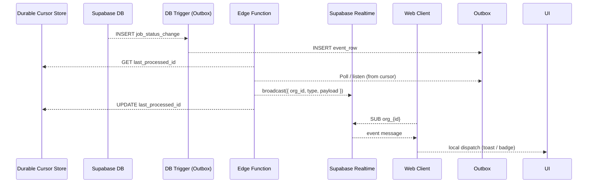

# TASK_6 – Real-Time Notification Architecture Review & Design Plan

## 1. Architectural Patterns

| Concern | Proposed Pattern | Rationale | Complexity vs. Benefit |
|---------|-----------------|-----------|------------------------|
| **Service Boundaries** | **Event-Driven Micro-Front + Edge Function** • Supabase DB → Edge Function → Realtime | Decouples write path (cataloging jobs) from read path (notifications). Enables independent scaling & deploy cadence. | **Medium ↔ High** Added infra (Edge Function) but isolates concerns and enables polyglot evolution. |
| **Channel Strategy** | **Per-Org Broadcast Channels** (`notifications:org_{id}`) | Minimizes fan-out (≈ N_org ≪ N_user), still enforces multi-tenancy via RLS. | **Low ↔ High** Slight channel management logic vs. major connection savings. |
| **Event Processing** | **Outbox / Change Data Capture** on `cataloging_jobs` + `flags` tables | Guarantees at-least-once delivery, avoids tight coupling with app logic. | **Medium ↔ High** Requires metadata table + triggers, but yields reliability & auditability. |
| **Notification Fan-out** | **Edge Function Fan-out** with batching window (e.g., 250 ms) | Reduces DB trigger load; coalesces bursts during bulk ops. | **Medium ↔ Medium** Extra component balances system load; modest complexity. |
| **Client Consumption** | **Local Event Bus** (TanStack Query invalidate + Toast dispatcher) | Keeps UI concerns local; other modules subscribe without cross-coupling. | **Low ↔ Medium** Simple pattern leverages existing hooks. |

---

## 2. Data Flow & Consistency

**Consistency Model:**
- **At-Least-Once** delivery via outbox & durable cursor checkpointing.
- **Idempotent Clients** consume `event_id` to ignore duplicates.
- **Eventual UI Consistency** (<100 ms p99) acceptable for notifications.

**State Management:**
- **Minimal Payloads:** Event payloads broadcast via Realtime must be minimal, containing only identifiers (e.g., `job_id`) and the `event_type`. Clients use this information to invalidate local cache (e.g., via TanStack Query) and refetch full data as needed. This prevents sensitive or large data from transiting the Realtime channel.
- **Client Cache is Source of Truth:** The client's TanStack Query cache remains the source of truth. Notifications only trigger invalidations or fetches.

**Offline Handling:**
- Service workers (web) / React Native queue while offline; flush on reconnect.
- Use indexedDB (web) or MMKV (mobile) for transient queue; drop after 24 h TTL.

---

## 3. Reliability & Maintenance

| Concern | Proposed Solution | Rationale | Complexity |
|---------|-------------------|-----------|------------|
| **Edge Function State** | **Durable Cursors:** The function must be stateless. Its read cursor must be stored durably in a dedicated `_private.cursors` table and updated atomically with event processing. | Prevents missed/duplicate events if the function restarts; ensures true at-least-once processing. | Low |
| **Poison Pill Events** | **Dead-Letter Queue (DLQ):** Events that repeatedly fail processing are moved to a `_private.outbox_dlq` table after 3 retries. | Prevents a single malformed event from blocking the entire notification pipeline. | Medium |
| **Outbox Growth** | **Scheduled Pruning:** A separate, scheduled Edge Function (`cron`) will periodically purge processed events from the `outbox` table (e.g., after a 72-hour TTL). | Prevents indefinite table growth, which would degrade performance and increase storage costs. | Low |

---

## 4. Scalability & Evolution

| Axis | Baseline | Growth Path | Trade-Offs |
|------|----------|-------------|------------|
| **Connection Count** | 1 WS per org-active tab/user | Upgrade to SharedArrayBuffer-based multiplexing or HTTP/3 QUIC push if >10 k concurrent orgs | Increased infra cost vs. maintaining manageable connection pool. |
| **Event Volume** | ≤ 1 k events/min (p95) | Shard Edge Functions by org hash; adopt Kafka / Redpanda if >20 k events/s | Additional infra & ops overhead but near-linear scale. |
| **Schema Evolution** | Versioned `payload` JSON + `event_type` enum | Add protobuf/avro schemas when typed contracts required | Serialization tooling overhead vs. stronger guarantees. |
| **Cross-Product Notifications** | Current scope: Cataloging jobs | Introduce `topic` field; consumers filter client-side | Slightly heavier messages vs. avoiding multiple channels. |

---

## 5. Complexity vs. Benefit Summary

| Decision | Complexity | Benefit | Verdict |
|----------|-----------|---------|---------|
| Per-Org Channels | Low | Large WS connection savings, simple RLS checks | **Adopt** |
| Outbox + Edge Function | Medium | Reliable delivery, decoupled workloads | **Adopt** |
| Batching Fan-out | Medium | Smooths spikes, protects RT service | **Adopt** with 250 ms window |
| Offline Queue | Medium | Seamless UX for intermittent networks | **Adopt** mobile & PWA only |
| Durable Cursors & DLQ | Medium | Production-grade reliability and error handling | **Adopt** |
| Schema Versioning v1 | Low | Future-proof event contracts | **Adopt** |
| Kafka Upgrade Path | High | Massive scale headroom | **Defer** until >20 k events/s |

---

## 6. Recommendation

The proposed design balances developer ergonomics with production scalability:
- **Loosely coupled** event flow via outbox + Edge Function keeps core cataloging path synchronous and performant.
- **Per-org channels** strike the right balance between isolation and connection footprint.
- **Reliability patterns** (Durable Cursors, DLQ, Pruning) provide the necessary robustness for a production system.
- **Incremental evolution** paths (Kafka, schema registry) are identified but not imposed upfront, keeping initial complexity moderate.

This architecture should comfortably support the projected load for MVP and can evolve with straightforward component swaps as scale demands. 